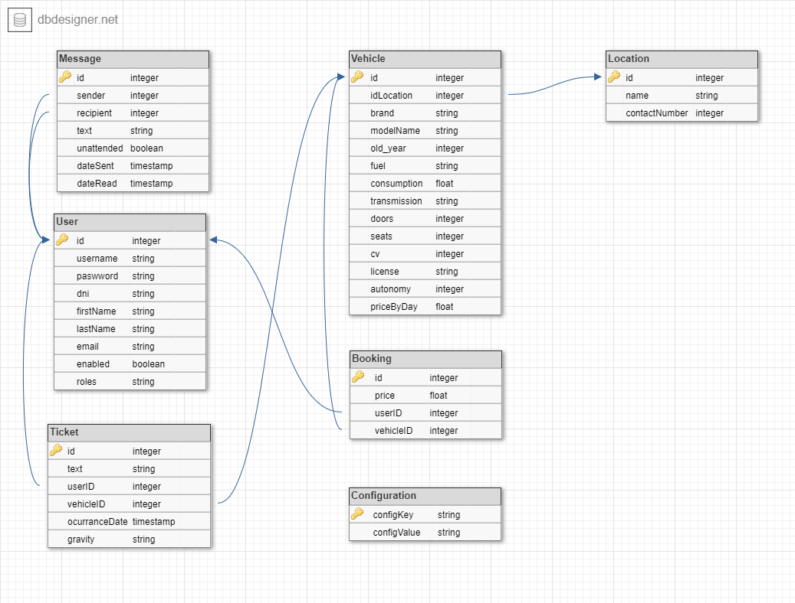

# RentARide - Entrega Pre-Examen

## Propuesta

La aplicación es una herramienta diseñada para ayudar a las compañías de alquiler a gestionar su flota de vehículos de manera eficiente. Con esta aplicación, las compañías podrán registrar y actualizar información detallada sobre cada uno de sus vehículos, incluyendo su marca, modelo y otros datos relevantes. 

Además, la aplicación permitirá a las compañías llevar un registro preciso de las reservas y alquileres de los vehículos, lo que les permitirá planificar mejor su flota y asegurarse de que siempre haya vehículos disponibles para sus clientes.

Los usuarios de la aplicación podrán reservar coches de manera fácil y rápida, seleccionando el vehículo que más se adapte a sus necesidades y disponibilidad.

## Funcionalidades

- Vehículos
  - Creación de nuevos vehículos
  - Listado de vehículos
  - Búsqueda de vehículos: por nombre de modelo 
  - Gestión de la flota: puediendose filtrar por varios campos
- Reservas
  - Realizar reservas de vehículos
  - Ver Mis reservas
  - Ver un calendario con todas las reservas de la semana anterior, la actual y la posterior, así como sus detalles
- Mensajes
  - Enviar mensajes por parte de los clientes
  - Panel de control para los gestores donde pueden atender mensajes y ver el historial de las conversaciones con todos los usuarios
- Incidencias
  - Se pueden abrir incidencias asociadas a una reserva
  - El usuario creador de la incidencia puede borrarla
  - Listado de incidencias para los gestores
  - Se pueden exportar las incidencias en formato CSV a través de la URL `/incidencias/export`
- Usuarios
  - Los usuarios pueden ver su perfil y editar los detalles
  - Los administradores pueden acceder a un listado para gestionar los usuarios, pudiendo modificarlos y borrarlos

## Diagrama de la DB

## Usuarios existentes

* Administrador
  * Usuario: *a*
  * Contraseña: *aa*
* Gestor
  * Usuario: *b*
  * Contraseña: *aa*
* Cliente
  * Usuario: *c*
  * Contraseña: *aa*

## Karate Testing

Hemos creado varios test para comprobar que funciona todo correctamente y es seguro:
- [file](./RentARide/src/test/java/external/createTicket.feature) : crea un ticket
- [file](./RentARide/src/test/java/external/createVehicle.feature) : crea un vehciulo
- [file](./RentARide/src/test/java/external/main.feature): Prueba de la vista principal
  - Scenario: Busqueda de un audi sin identificarse
  - Scenario: Buscar coche por id estando logeado y reservarlo
- [file](./RentARide/src/test/java/external/security.feature): Seguridad
  - Scenario: Ver las paginas que puede entrar un cliente sin resgitrar 
  - Scenario: Intentar acceder a cosas que no se pueden no estando registrado
  - Scenario: Intentar acceder a cosas que no se pueden siendo usuarios
- [file](./RentARide/src/test/java/external/login.feature): Prueba de login y logouts
  - Scenario: login malo en plantilla
  - Scenario: login correcto como b
  - Scenario: login correcto como a
  - Scenario: login correcto como user
  - Scenario: logout after login

## Comentarios

Nos habría quedado por implementar la carga de la flota de coches a través de un fichero para permitir la carga masiva. 