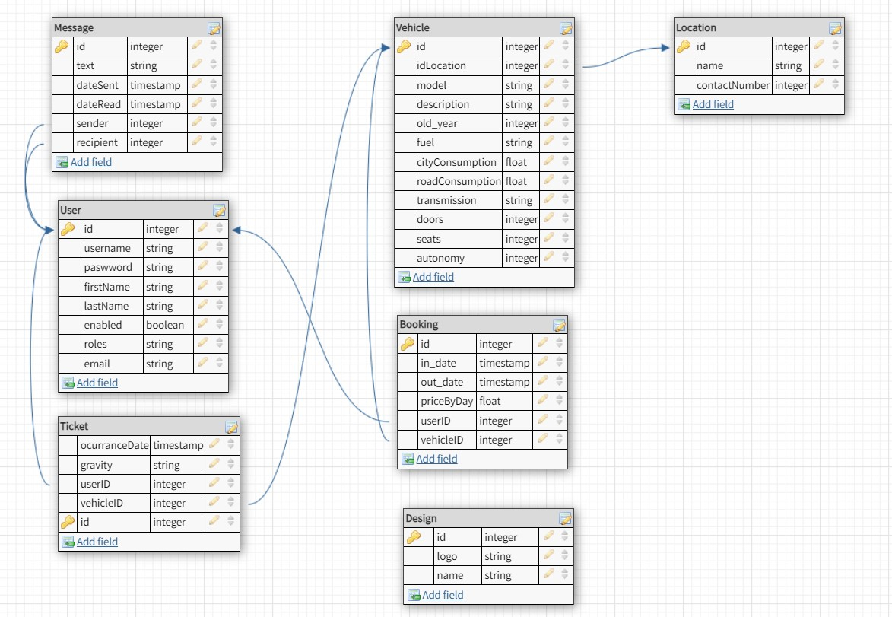

# IW
`Propuesta`: Aplicación de alquiler de vehiculos implementada eficientemente para empresas de renting.

Enlace para figma [link](https://www.figma.com/file/UY1222Ks3zLpMzkwTa3BFu/IW?node-id=0%3A1&t=WUMRbF9RT37ijLMI-1)

## Funcionalidades implementadas
- Gestion de usuarios (😄) vistas: Perfil, Crear, Borrar, Logear
- Gestion de coches (😄) vistas: Crear vehiculo
- Gestion de chats (😄)  vistas: mensajes entratantes + chat desplegable ( pensado en dudas generales para averias crear tickect)
- Gestion de reservas(😄): vistas: mis reservas y crear reservas y verlas 
- Gestión de flota:
    1. Vista de calendario administracion (😄)
    2. Busquedas en gestion de flota (😄) : filtros + editar vehiculo 
- Gestion de incidentes(😄): mis incidencias ( se pueden crear teniendo una reserva y tambien se pueden eliminar)

Salvo posibles fallos de escenarios complejos o el modal de cargar datos de vehiculo todo va, faltaria restringir acceso a vistas dependiendo de si es USUARIO/GESTOR/ADMIN. Y mejorar codigo en algunos sitios.

## Imagenes de coches y usuarios 
Al ser editables no estan en el static del proyecto
Estan ubicadas en la capeta [iwdata](./RentARide/iwdata/)

## Docs

- Estilos [css](./Presentacion/css/)
- Imagenes [img](./Presentacion/img/)
- Propuesta [index](./Presentacion/index.html)

## Base de datos

De momento se carga todo desde import.sql, mas adelante habra que hacer una prueba automatica que carge todo desde fichero csv 
este fichero habra que crear una clase para que lo cree.

## Logs
Para debugear se lleva la INFO al fichero app.log

## DB

[designer_link](https://dbdesigner.page.link/XSEH3FhGSRpSoBXG9)

## Develop

- [edit](https://guacamole.containers.fdi.ucm.es/)
- [view](https://vm34.containers.fdi.ucm.es/)

## Roles

- Admin: todo, editar usuarios en especial
- Gestor: 
    usuario + calendario + gestion flota + gestion incidencias - gestion usurios 
- Usuario: flujo principal

